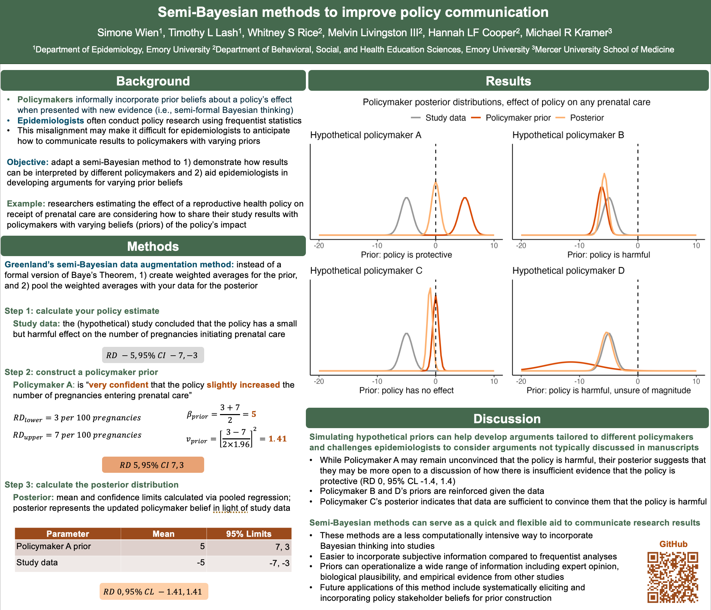

# About this repository

This repository includes all code used to apply Greenland's semi-Bayesian data augmentation method to 1) simulate how study results can be interpreted by different hypothetical policymakers and 2) aid epidemiologists in developing arguments for varying prior beliefs.

To learn more about Greenland's semi-Bayesian data augmentation method: 
1. [Bayesian perspectives for epidemiological research: I. Foundations and basic methods](https://pubmed.ncbi.nlm.nih.gov/16446352/) by Sander Greenland (2006)
2. [Bayesian perspectives for epidemiological research. II. Regression analysis](https://pubmed.ncbi.nlm.nih.gov/17329317/) by Sander Greenland (2007)
3. [Bayesian perspectives for epidemiologic research: III. Bias analysis via missing-data methods](2009) by Sander Greenland (2009)

To see an application of this method in a policy setting: 
1. [Would Stronger Seat Belt Laws Reduce Motor Vehicle Crash Deaths? : A Semi-Bayesian Analysis](https://pubmed.ncbi.nlm.nih.gov/30964813/) by Sam Harper (2019). 
 
Presented at the Society for Epidemiological Research annual meeting as a poster presentation, June 2025 (poster at the end of this page). 

# File structure

This repository contains the following file structure:

-`code/`

-`data/`

-`figures/`

-`README`

# Code description

The files below perform the following: 

`code/01-create-function.R`
- creates function `pool_estimates_ci` to pool `n` number of estimates to calculate the pooled mean, variance, and standard errors using 95% CIs on the risk difference scale, normal distribution

`code/02-calculate-posterior.R`
- uses `pool_estimates_ci` to calculate posterior distributions using hypothetical study data and policymaker priors
- saves results (`posteriors.csv`) to `data/`

`code/03-plot-results.R`
- generates density plot of prior, study data, and posterior distributions 
- saves plot in `figures/`

# SER poster

